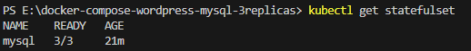
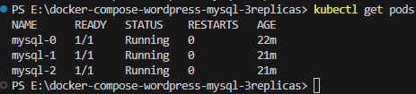
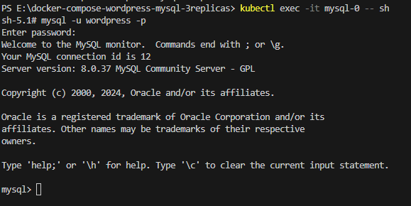
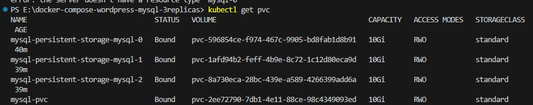
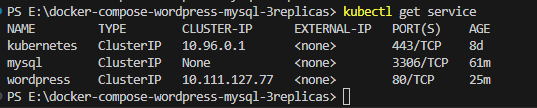
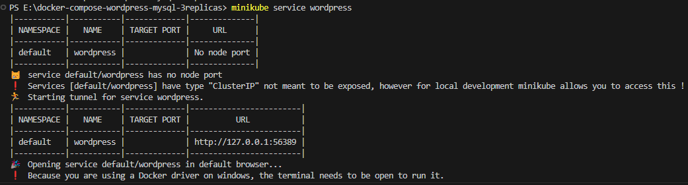
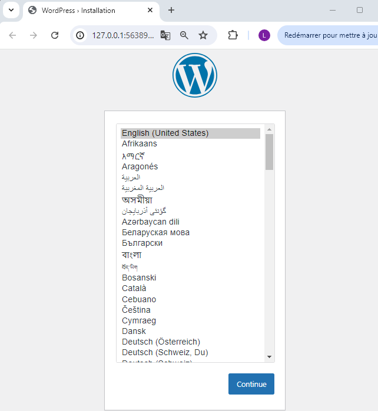
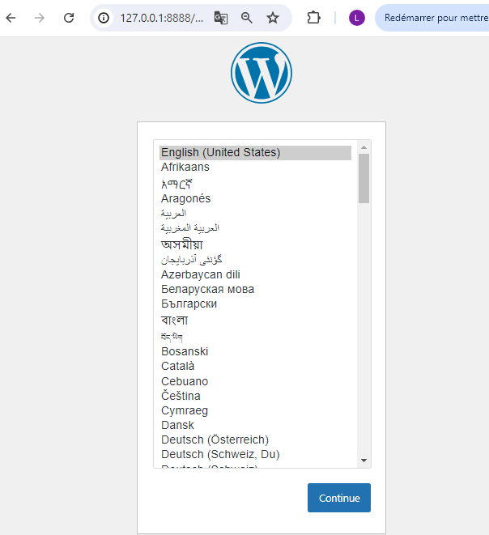
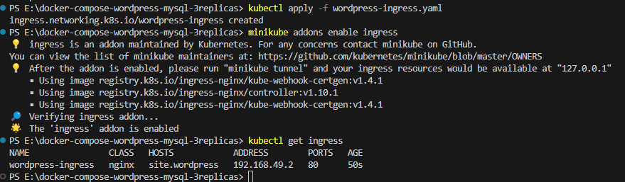
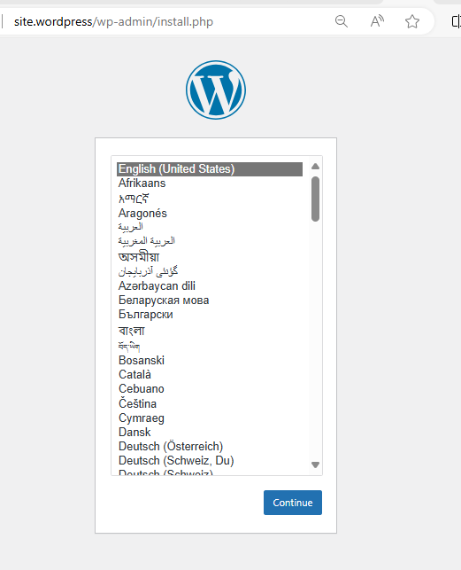

# Ce projet déploit 
•	Pour une Agence web: 1 application Stateful avec trois réplicas WordPress et bases de données mysql

=> Une foirs les déploiements terminés un service ingress 'wordpress-ingress' sera lancé pour accéder à l'interface wordpress

# Démarrer minikube si ce n'est pas la cas

minikube start

# Lier le repository docker minikube à son terminal
minikube -p minikube docker-env | Invoke-Expression

# Créer le déploiement et le service mysql

kubectl apply -f mysql-pvc.yaml

kubectl apply -f mysql-service.yaml

kubectl apply -f mysql-statefulset.yaml

# Vérifier que les base sont bien déployées et accessibles via la ligne des commandes

Les services déployés

Le service mysql est déployé

Le statefulset mysql déploiement : nous aurons 3 replicas mysql 

Les pods sont démarrés

Pour accéder à ces instances mysql il suffit de lancer les commandes suivantes:
récupérer le nom du pods mysql et lancer cette commande

kubectl exec -it mysql-0 -- sh

Vous pouvez exécuter les commandes sql classiques pour manipuler la base.
Pour sortir de la fenêtre tapper exit.

Pour les autres pods de la même manière nous pouvons vérifier l'accessibilité en utilisant les comptes root ou wordpress configurés dans le mysql-staefulset

Si le déployement msql ne fonctionne pas, lancer cette commande avec le nom du pvc pour voir le message d'erreur
kubectl get pvc

kubectl describe pvc mysql-persistent-storage-mysql-0

Chercher la colonne Message pour voir si un message d'erreur est indiqué.

# Créer le déploiement et le service wordpress

kubectl apply -f wordpress-pvc.yaml

kubectl apply -f wordpress-service.yaml

kubectl apply -f wordpress-deployment.yaml

# Vérifier les services déployés
kubectl get service

# Lancement du service wordpress sans l'ingress
vous pouvez lancer cette commande

minikube service wordpress

Le navigateur sera lancé sinon copier l'url affichée dans un navigateur

Ctl+C ==> pour arrêtre le service

# Une autre commande pour lancer le service wordpress en précisant le port

kubectl port-forward svc/wordpress 8888:80

l'interface wordpress est disponible à l'adresse : 127.0.0.1:8888

Ctl+C ==> pour arrêtre le service

# Deployer wordpress-ingress.yaml et activer l'ingress controller
dans un premier préparer la configuration suivante

Dans le fichier hostname j'ai une configuration wordpress-ingress avec un nom de host site.wordpress et @IP du minikube ==> sur le PC windows l'@IP à configurer est 127.0.0.1 (localhost)

127.0.0.1 et le port d'écoute 80

Ajouter cette ligne dans le fichier 'C:\Windows\System32\drivers\etc\hosts' 
127.0.0.1 site.wordpress

# Déployer l'ingress
kubectl apply -f wordpress-ingress.yaml

# Exécuter la commande suivantes
minikube addons enable ingress

# Afficher les ingress
kubectl get ingress

Lancer la commande suivante sur un terminale pour mettre l'ingress à disposition et donner l'accès au site wordpress (service wordpress) dans un navigateur

minikube tunnel

=== Voici le site  ===
==============================================================================================
Vérifier sur un navigateur l'accessibilité à l'interface wordpress via le nom du site
configurer dans le fichier hosts

/site.wordpress

